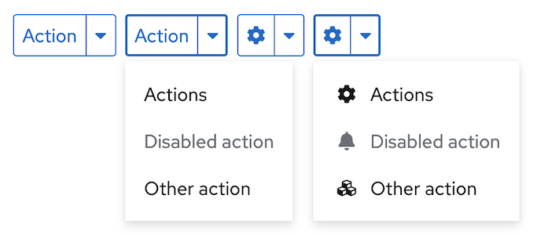

# PatternFly Release Highlights
## Release 2022.10
----------------------------------------------------------
## New features and enhancements

### [Secondary-styled split button](https://www.patternfly.org/v4/components/dropdown#split-button-secondary-action)

 We've added a split button variant that has secondary button styling for use in situations where you want a split button with button styling for more consistency with other actions on a page.

### [Description list card variant](https://www.patternfly.org/v4/components/description-list#card-variants)

Introduces a new variant of the description list that makes items look like a dashboard card but retain description list semantics.

### [Tree view with selectable parent nodes](https://www.patternfly.org/v4/components/tree-view#with-separate-selection-and-expansion)

Parent nodes in a tree view can now have select actions (e.g. for navigation) associated with them as well as being used to expand or collapse the node.

### [Tabs with overflow](https://www.patternfly.org/v4/components/tabs#horizontal-overflow)

If there are too many horizontal tabs to fit within the width of a container, we now support the ability to hide overflowing tabs in a dropdown menu that is opened from the last tab.

### [Responsive progress stepper](https://www.patternfly.org/v4/components/progress-stepper)

Our progress stepper can now change from a horizontal to vertical orientation as the width of the viewport is reduced.

### [Height breakpoint support for sticky sections](https://www.patternfly.org/v4/components/page/react-demos#sticky-section-breadcrumb-with-breakpoints)

We now support breakpoints based on the viewport height as well as width. This will allow sticky page section behavior to be modified when the viewport is shrunk below a certain height, allowing sticky page sections to scroll.

See the [latest release notes](https://www.patternfly.org/v4/developer-resources/release-notes) for a more detailed list of changes.

-----------------------------------------------------------------------------

## What we’re working on...

### 2022.11 (August 26)

* [Truncation/disclosure box with inline "show more/less" action](https://github.com/patternfly/patternfly-react/issues/7780) - will create the ability to truncate a block of text and allow the user to display the full content upon clicking "Show more."

* [Timestamp component](https://github.com/patternfly/patternfly-react/issues/7729) - will add a new component to convert a raw time value into a formatted string for displaying to the user.

* [Number input with status icon](https://github.com/patternfly/patternfly-react/issues/7730) - adds a new variant of the Number input component that allows a status icon to be placed in the input field.

### 2022.12 (September 16)

* [Search input - expandable masthead variant](https://github.com/patternfly/patternfly-react/issues/7380) - adding a variant of the search input that can be used in the masthead and expanded or collapsed inline with other elements.

* [Checkbox - add ability to indicate they are required](https://github.com/patternfly/patternfly-react/issues/7830) - want to add the ability to add the required indicator (red asterisk) to a checkbox label. This is useful when the user must acknowledge certain information (e.g. terms and conditions) before proceeding.

For a complete roadmap showing all items planned in future releases, see our [PatternFly Feature Roadmap](https://github.com/orgs/patternfly/projects/4?fullscreen=true) project board.
