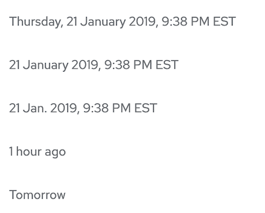
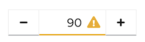

# PatternFly Release Highlights
## Release 2022.11
----------------------------------------------------------
## New features and enhancements

 ### [Expandable section with inline "show more/less" action]()

 Adds the ability to truncate a block of text and allow the user to display the full content upon clicking "Show more."

 ### [Timestamp component](https://www.patternfly.org/v4/components/timestamp)

 Adds a new component to convert a raw time value into a formatted string for displaying to the user.

 ### [Number input with status icon]()

 Adds a new variant of the Number input component that allows a status icon to be placed in the input field. This may be used to provide feedback to users about input values relative to a threshold value.

See the [latest release notes](https://www.patternfly.org/v4/developer-resources/release-notes) for a more detailed list of changes.

-----------------------------------------------------------------------------

## What we’re working on...

### 2022.12 (September 16)

* [Search input - expandable masthead variant](https://github.com/patternfly/patternfly-react/issues/7380) - adding a variant of the search input that can be used in the masthead and expanded or collapsed inline with other elements.

* [Checkbox - add ability to indicate they are required](https://github.com/patternfly/patternfly-react/issues/7830) - want to add the ability to add the required indicator (red asterisk) to a checkbox label. This is useful when the user must acknowledge certain information (e.g. terms and conditions) before proceeding.

* [Overflow menu - set breakpoint relative to container width](https://github.com/patternfly/patternfly-react/issues/7376) - responsive breakpoints are typically based on viewport width. This enhancement will update the [Overflow menu](https://www.patternfly.org/v4/components/overflow-menu) component to send overflow elements to the overflow menu when its container is resized.

* [PageSection - add ability to specify HTML elements via props](https://github.com/patternfly/patternfly-react/issues/7419) - add an additional prop to PageSection that allows users to specify the underlying HTML element used, similar to Card and other components.

### 2022.13 (October 7)

* [Plain read-only form input](https://github.com/patternfly/patternfly/issues/4935) - adds the option to place a read-only input into a form that has styling similar to [description list](https://www.patternfly.org/v4/components/description-list/) items (no background or borders).

For a complete roadmap showing all items planned in future releases, see our [PatternFly Feature Roadmap](https://github.com/orgs/patternfly/projects/4?fullscreen=true) project board.
