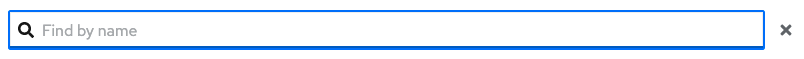
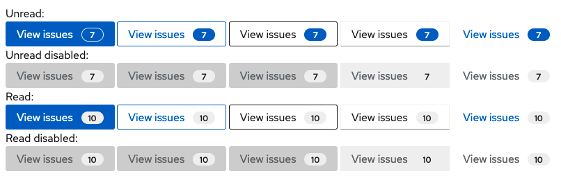

# PatternFly Release Highlights
## Release 2022.12
----------------------------------------------------------
## New features and enhancements

 ### [Expandable search input](https://www.patternfly.org/v4/components/search-input#with-expandable-button)

 Adds a variant of the search input that can be collapsed to an icon for use in a masthead or other places with limited space. When expanded, it will open inline.

 ### [Required checkboxes](https://www.patternfly.org/v4/components/checkbox#required-input)

 Allows for adding the required indicator (red asterisk) to a checkbox label. This is useful when the user must acknowledge certain information (e.g. terms and conditions) before proceeding.

 ### [Button with count](https://www.patternfly.org/v4/components/button#button-with-count)

 

 Adds a optional badge to a button that can annotate the button label with a count value.

 ### [PageSection - specifying HTML elements via props](https://www.patternfly.org/v4/components/page)

 It's now possible to specify the underlying HTML element used in a PageSection, similar to Card and other components.

 ### Next components

 This release introduces Next versions of the [Dropdown](https://www.patternfly.org/v4/components/dropdown/react-next) and [Wizard](https://www.patternfly.org/v4/components/wizard/react-next) components. These are newer implementations of the components that will replace existing versions in the next major release.

See the [latest release notes](https://www.patternfly.org/v4/developer-resources/release-notes) for a more detailed list of changes.

-----------------------------------------------------------------------------

## What we’re working on...

### 2022.13 (October 7)

* [Overflow menu - set breakpoint relative to container width](https://github.com/patternfly/patternfly-react/issues/7376) - responsive breakpoints are typically based on viewport width. This enhancement will update the [Overflow menu](https://www.patternfly.org/v4/components/overflow-menu) component to send overflow elements to the overflow menu when its container is resized.

* [Plain read-only form input](https://github.com/patternfly/patternfly-react/issues/7930) - adds the option to place a read-only input into a form that has styling similar to [description list](https://www.patternfly.org/v4/components/description-list/) items (no background or borders).

### 2022.14 (October 28)

* [Menu - add a danger state menu item](https://github.com/patternfly/patternfly/issues/5057) - adds optional "danger" menu option styling to use for potentially destructive actions.

* [Sidebar - allow for custom content](https://github.com/patternfly/patternfly/issues/4982) - this will allow for placing custom content in the left hand sidebar, below the navigation. This is difficult with the current implementation.

For a complete roadmap showing all items planned in future releases, see our [PatternFly Feature Roadmap](https://github.com/orgs/patternfly/projects/4?fullscreen=true) project board.
