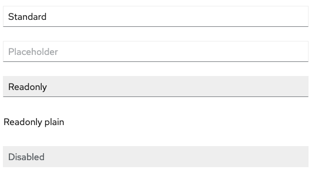
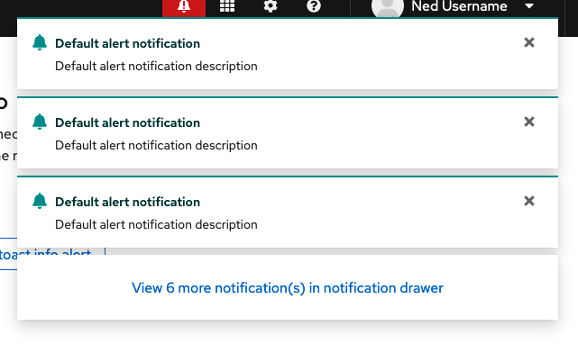

# PatternFly Release Highlights
## Release 2022.13
----------------------------------------------------------
## New features and enhancements

### [Plain read-only form input](https://www.patternfly.org/v4/components/text-input#read-only)

Adds a read-only input that has styling similar to [description list](https://www.patternfly.org/v4/components/description-list/) items (no background or borders). This is useful when the standard read-only input is too visually heavy or likely to be confused with the disabled input.

### [Link style progress button](https://www.patternfly.org/v4/components/button#progress-indicators)

Adds a new variant of the Progress button that has plain or link button styling (no borders). This is useful for Test buttons or similar actions that fall inline within a form.

### [Alert group with overflow](https://www.patternfly.org/v4/components/alert-group/react-demos/alert-group-toast-with-notification-drawer/)

This is a new demo that shows how the overflow feature of an alert group can be used to only show a predetermined number of toast alerts while making additional alerts viewable in a notification drawer.

 ### [Overflow menu - set breakpoint relative to container width](https://www.patternfly.org/v4/components/overflow-menu#breakpoint-on-container)

 Responsive breakpoints are typically based on viewport width. This enhancement updates the [Overflow menu](https://www.patternfly.org/v4/components/overflow-menu) component to send overflow elements to the overflow menu when its container is resized.

 ### [Icon component](https://www.patternfly.org/v4/components/icon)

 Introduces a new component to be used when placing an icon or a spinner inline with other elements. The icon component supports multiple sizes and will add the proper spacing around the icon.

 ### [Filter demos](https://www.patternfly.org/v4/demos/filters)

 Introduces a new set of full page demos that show how various filter patterns as described in the [Filters design guidelines](https://www.patternfly.org/v4/guidelines/filters) can be applied to a table.

 ### [PatternFly wireframe kit](https://github.com/patternfly/patternfly-design-kit/blob/master/PatternFly%204%20-%20Wireframe%20library%20and%20template/Wireframe%20kit%20guideline.md)

 With this release we are also introducing a PatternFly wireframe kit. This is a new symbol library implemented in Sketch that helps designers create low or mid-fidelity mockups that are compatible with PatternFly styles.

See the [latest release notes](https://www.patternfly.org/v4/developer-resources/release-notes) for a more detailed list of changes.

-----------------------------------------------------------------------------

## What we’re working on...

### 2022.14 (October 28)

* [Menu - add a danger state menu item](https://github.com/patternfly/patternfly-react/issues/8058) - adds optional "danger" menu option styling to use for potentially destructive actions.

* [Banner - add support for status icons](https://github.com/patternfly/patternfly-react/issues/8113) - to make our banners more accessible, we are building in support for a status icon preceding a text message. This will enable redundant coding for color blind users.

### 2022.15 (November 18)

* [Bulk selection - display loading state](https://github.com/patternfly/patternfly/issues/4926) - add an inline spinner to the split button used for bulk selection to provide better feedback when bulk select actions will take time to complete.

* [File upload - allow customization of display message](https://github.com/patternfly/patternfly/issues/4915) - for multiple file uploads, this will give consumers the ability to customize the progress message that displays and provide better error feedback.

* [Add popover help for Tabs](https://github.com/patternfly/patternfly/issues/5139) - will add the ability to open a help popover from a tab to provide more information about its contents.

For a complete roadmap showing all items planned in future releases, see our [PatternFly Feature Roadmap](https://github.com/orgs/patternfly/projects/4?fullscreen=true) project board.
