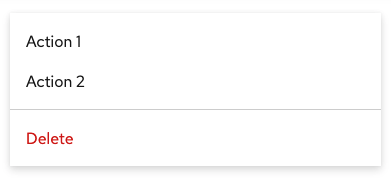
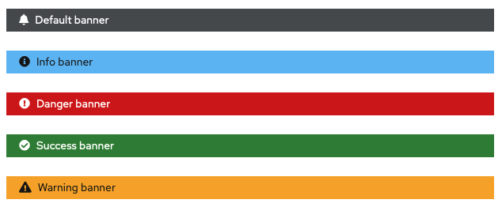

# PatternFly Release Highlights
## Release 2022.14
----------------------------------------------------------
## New features and enhancements

### [Menu - new danger menu item]()

Adds optional "danger" menu option styling to use for potentially destructive actions.

### [Banner - support for status icons]()

To make our banners more accessible, we've' built in support for a status icon preceding a text message when color is meant to convey status. This will enable redundant coding for color blind users.

See the [latest release notes](https://www.patternfly.org/v4/developer-resources/release-notes) for a more detailed list of changes.

-----------------------------------------------------------------------------

## What we’re working on...

### 2022.15 (November 18)

* [File upload - allow customization of display message](https://github.com/patternfly/patternfly-react/issues/8238) - for multiple file uploads, this will give consumers the ability to customize the progress message that displays and provide better error feedback.

* [Add popover help for Tabs](https://github.com/patternfly/patternfly-react/issues/8236) - will add the ability to open a help popover from a tab to provide more information about its contents.

### 2022.16 (December 9)

* [Bulk selection - display loading state](https://github.com/patternfly/patternfly/issues/4926) - add an inline spinner to the split button used for bulk selection to provide better feedback when bulk select actions will take time to complete.

For a complete roadmap showing all items planned in future releases, see our [PatternFly Feature Roadmap](https://github.com/orgs/patternfly/projects/4?fullscreen=true) project board.
