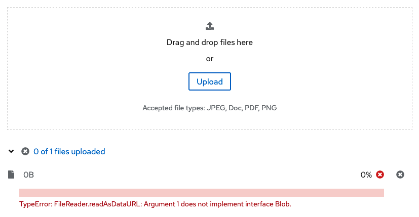
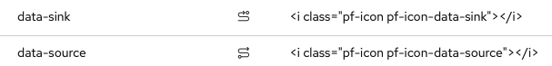

# PatternFly Release Highlights
## Release 2022.15
----------------------------------------------------------
## New features and enhancements

### [File upload - allow customization of progress message](https://www.patternfly.org/v4/components/file-upload---multiple)

For multiple file uploads, this gives consumers the ability to customize the progress message that displays to provide better error feedback. This is accomplished by adding the capability to add custom helper text below the progress component.

### [Popover help for Tabs](https://www.patternfly.org/v4/components/tabs#help-action)

Adds the ability to open a help popover from a tab to provide more information about its contents.

### Data sync and data source icons

Added Data Sync and Data Source as new custom icons.

See the [latest release notes](https://www.patternfly.org/v4/developer-resources/release-notes) for a more detailed list of changes.

-----------------------------------------------------------------------------

## What we’re working on...

### 2022.16 (December 9)

* [Menu - add ability to filter items in a drilldown menu](https://github.com/patternfly/patternfly-react/issues/6965) - will allow for the insertion of a filter within a drilldown menu to narrow the scope of choices when there are potentially many items to choose from.

### 2023.01 (January 27)

* [Bulk selection - display loading state](https://github.com/patternfly/patternfly/issues/4926) - add an inline spinner to the split button used for bulk selection to provide better feedback when bulk select actions will take time to complete.

* [Add Processor icon](https://github.com/patternfly/patternfly-design/issues/1210) - Add a new icon to represent a processor object.

For a complete roadmap showing all items planned in future releases, see our [PatternFly Feature Roadmap](https://github.com/orgs/patternfly/projects/4?fullscreen=true) project board.
