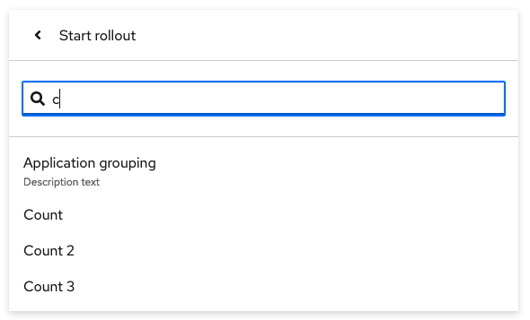

# PatternFly Release Highlights
## Release 2022.16
----------------------------------------------------------
## New features and enhancements

### [Menu - drilldown menu with filter](https://www.patternfly.org/v4/components/menu#with-drilldown-and-inline-filter)

This update allows for the insertion of a filter within a drilldown menu to narrow the scope of choices when there are potentially many items to choose from.

### [Search input - input now allows spaces](https://www.patternfly.org/v4/components/search-input#advanced)

The advanced search input has been enhanced to allow for spaces inside a search string provided that they are wrapped in quotes.

See the [latest release notes](https://www.patternfly.org/v4/developer-resources/release-notes) for a more detailed list of changes.

-----------------------------------------------------------------------------

## What we’re working on...

### 2023.01 (January 27)

* [Bulk selection - display loading state](https://github.com/patternfly/patternfly-react/issues/8237) - add an inline spinner to the split button used for bulk selection to provide better feedback when bulk select actions will take time to complete.

* [Add Processor icon](https://github.com/patternfly/patternfly/issues/5263) - Add a new icon to represent a processor object.

Note that this will be the last planned release for PatternFly 4. After January the team will shift focus to delivering a new PatternFly 5 release slated for June 2023.

For a complete roadmap showing all items planned in future releases, see our [PatternFly Feature Roadmap](https://github.com/orgs/patternfly/projects/4?fullscreen=true) project board.
