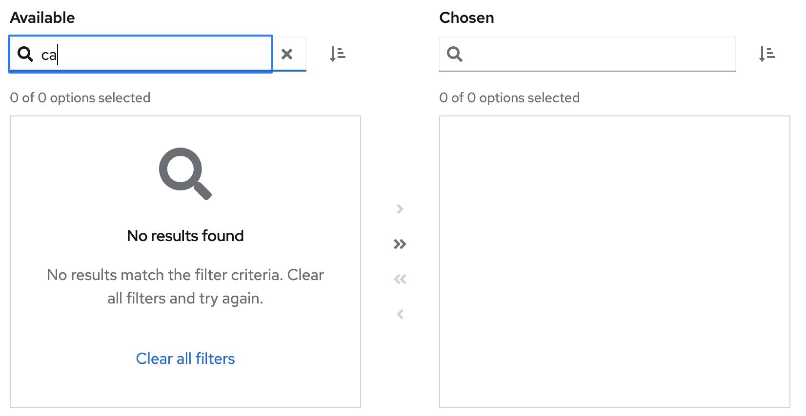

# PatternFly Release Highlights
## Release 2023.01
----------------------------------------------------------
## New features and enhancements

### [Processor icon](https://www.patternfly.org/v4/guidelines/icons) 

Added a new icon named `pf-icon-data-processor` to represent a processor object.

### [Dual list selector - empty state](https://www.patternfly.org/v4/components/dual-list-selector#composable-structure)

A "no results" empty state message is added to the composable Dual list selector when a filter is applied and all the options are filtered out.

### [Bulk selection - display loading state](https://www.patternfly.org/v4/components/dropdown#split-button-progress-checkbox) 

Adds an inline spinner to the split button used for bulk selection to provide better feedback when bulk select actions will take time to complete.

See the [latest release notes](https://www.patternfly.org/v4/developer-resources/release-notes) for a more detailed list of changes.

-----------------------------------------------------------------------------

## What we’re working on...

This will be the last planned release for PatternFly 4. A major new release  (PatternFly 5) is slated for June 2023. This will include many new features, including:

* An updated CSS variable system to provide official support for dark theme and additional themes moving forward.

* React 18 support.

* Improvements to existing components to aid make them more flexible and efficient to work with.

* Website improvements to make it easier to find what you are looking for, preview components in light or dark theme, and expose documentation for PatternFly extensions.

Codemods, documentation, and developer support will be available to make it easy to migrate from PatternFly 4.
